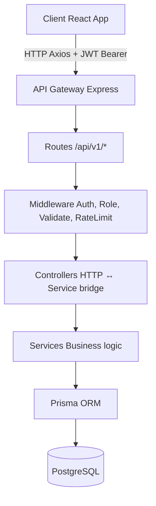
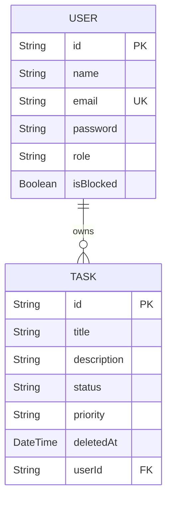

# Task Management System

✓ 31/31 Tests Passing  
✓ 88.5% Coverage  
✓ Swagger/OpenAPI  
✓ JWT + Refresh Tokens  
✓ RBAC  
✓ Docker  
✓ PostgreSQL + Prisma

Task Management System built with Node.js, Express, PostgreSQL, Prisma, React, JWT Authentication, RBAC, Swagger, Docker, and Automated Testing.

## Overview

This project is a full-stack Task Management System developed as a Backend Developer Internship assignment. It demonstrates a scalable, secure, and fully-tested architecture suitable for production deployments.

## Highlights

- 31/31 Automated Tests Passing
- 88.5% Test Coverage
- JWT Authentication + Refresh Tokens
- Role-Based Access Control (RBAC)
- PostgreSQL + Prisma ORM
- Swagger/OpenAPI Documentation
- Dockerized Deployment
- Soft Deletes
- Search, Filtering & Pagination

## Architecture

The project follows a layered architecture: Controller → Service → Prisma. This separation improves maintainability, testability, and scalability.



### Request Flow

Client
↓
JWT Authentication Middleware
↓
Validation Middleware (Zod)
↓
Controller
↓
Service
↓
Prisma ORM
↓
PostgreSQL

## Design Decisions

**Why Prisma?**
- Type-safe ORM
- Built-in migration support
- Excellent developer experience and autocompletion

**Why PostgreSQL?**
- Strong relational integrity
- ACID compliance
- High scalability for complex queries

**Why Service Layer Architecture?**
- Separation of concerns (keeps controllers thin)
- Easier unit and integration testing
- Business logic is reusable across different routes or protocols

## Tech Stack

### Backend
- Node.js & Express.js
- PostgreSQL & Prisma ORM
- JWT Authentication
- Zod Validation
- Swagger/OpenAPI
- Winston Logging
- Jest & Supertest

### Frontend
- React & Vite
- Axios
- React Router

### DevOps
- Docker & Docker Compose
- GitHub Actions CI/CD

## Features

### Core Features
- User Registration & Login
- Task CRUD Operations (Create, Read, Update, Delete)
- Soft Deletes for Tasks
- Search, Pagination, Status & Priority Filtering
- Admin Dashboard (View/Block Users, Manage Any Task)

### Security Features
- **Authentication**: Access Tokens (15 minutes), Refresh Tokens (7 days)
- **Authorization**: Strict Role-Based Access Control (User vs Admin)
- **Data Protection**: bcrypt password hashing (12 rounds), Zod Input Validation, XSS Sanitization, Helmet Security Headers, Request Rate Limiting

### Developer Features
- Swagger/OpenAPI Documentation
- Docker & Docker Compose Support
- Winston Structured Logging
- Automated Testing Pipeline (CI/CD via GitHub Actions)
- Prisma Migrations

## Database Schema



## API Endpoints

| Method | Endpoint | Description |
|--------|----------|-------------|
| **POST** | `/api/v1/auth/register` | Register new user |
| **POST** | `/api/v1/auth/login` | Login user |
| **POST** | `/api/v1/auth/refresh` | Refresh JWT access token |
| **POST** | `/api/v1/tasks` | Create a new task |
| **GET** | `/api/v1/tasks` | Get paginated & filtered tasks |
| **GET** | `/api/v1/tasks/:id` | Get specific task details |
| **PUT** | `/api/v1/tasks/:id` | Update specific task |
| **DELETE** | `/api/v1/tasks/:id` | Soft delete a task |
| **GET** | `/api/v1/admin/users` | View all users (Admin only) |
| **PATCH** | `/api/v1/admin/users/:id/block` | Block a user (Admin only) |
| **PATCH** | `/api/v1/admin/users/:id/unblock` | Unblock a user (Admin only) |
| **DELETE** | `/api/v1/admin/tasks/:id` | Delete any task (Admin only) |
| **GET** | `/api/v1/health` | System health check |

### Login Response Example

```json
{
  "success": true,
  "message": "Login successful",
  "data": {
    "user": {
      "id": "12345-uuid",
      "name": "John Doe",
      "email": "john@test.com",
      "role": "user"
    },
    "accessToken": "eyJhbGci...",
    "refreshToken": "def456..."
  }
}
```

## Local Development

### Running the Project Locally

**Backend Server:** `http://localhost:5000`  
**Frontend React App:** `http://localhost:5173`  
**Swagger API Docs:** `http://localhost:5000/api-docs`  

### Backend Setup

1. **Install dependencies:**
   ```bash
   cd backend
   npm install
   ```

2. **Configure Environment Variables:**
   Copy `.env.example` to `.env` and fill in your database connections (e.g., Supabase or local PostgreSQL) and JWT secrets.
   ```bash
   cp .env.example .env
   ```

3. **Initialize Database & Start:**
   Push the schema to your database, seed the admin account, and start the server.
   ```bash
   npx prisma db push
   npx prisma generate
   npm run seed
   npm run dev
   ```

### Frontend Setup

```bash
cd frontend
npm install
npm run dev
```

### Docker

Start full stack via Docker Compose:

```bash
docker compose up --build -d
```

## Automated Testing

The backend includes a full test suite using Jest and Supertest. It utilizes a dedicated Docker container for a completely isolated test database.

### Test Coverage Areas
- Authentication & Session Integrity
- Refresh Tokens & Revocation
- Role-Based Access Control (RBAC)
- Ownership Security Checks
- Input Validation (Zod)
- Pagination & Search Constraints
- Soft Deletes
- Admin Operations

1. Ensure Docker Desktop is running.
2. Navigate to the backend directory and run the test sequence:

```bash
cd backend
npm run test:db:start     # Starts the isolated PostgreSQL test container
npm run test:prepare      # Runs Prisma migrations on the test DB
npm run test:coverage     # Runs all Jest tests and generates a coverage report
npm run test:db:stop      # Cleans up and shuts down the test container
```

## Scalability Architecture & Roadmap

As the system grows, the following architectural improvements are planned for horizontal scaling and high availability:

### 1. Caching Layer (Redis)
- **Data Caching:** Cache frequently accessed, read-heavy data like paginated task lists to reduce database load.
- **Session Management:** Store refresh tokens in Redis with a TTL matching their expiry for immediate token revocation upon logout.
- **Blacklisting:** Maintain a Redis-backed blacklist of revoked access tokens to handle forced logouts and password changes.

### 2. Database Scaling
- **Connection Pooling:** Utilize Supabase Session Pooler (PgBouncer) to efficiently manage thousands of concurrent connections.
- **Read Replicas:** Implement PostgreSQL read replicas for heavy `GET` requests (e.g., fetching task lists or admin reporting) while directing `POST/PUT/DELETE` traffic to the primary node.

### 3. Asynchronous Processing (Message Brokers)
- Integrate **RabbitMQ** or **Kafka** to handle background tasks asynchronously without blocking the main API thread.
- **Use cases:** Sending email notifications, generating daily/weekly activity reports, and processing bulk task imports.

### 4. Microservices Decomposition
- Split the current monolithic Express app into independent services if business domains grow large enough:
  - **Auth Service** (handles JWT, users, RBAC)
  - **Task Service** (handles CRUD and business logic for tasks)
  - **API Gateway** (routes requests, handles rate-limiting and global auth checks)

### 5. Deployment & Orchestration
- Migrate from Docker Compose to **Kubernetes (K8s)** to manage container replicas, handle auto-scaling based on CPU/Memory, and perform zero-downtime rolling updates.
- CI/CD pipelines (via GitHub Actions) are already implemented to automate testing and builds.

## Screenshots

### Login Page


### User Dashboard


### Admin Dashboard


### Swagger Documentation


## Author

Yash Bhardwaj

Backend Developer Internship Assignment
