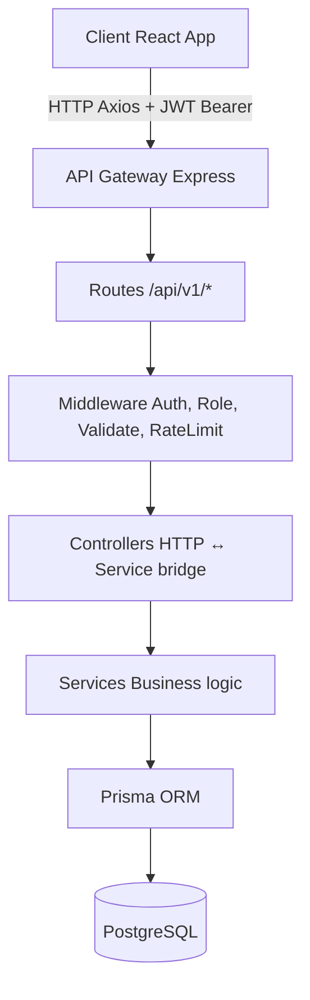

# Task Management System

Production-ready Task Management System built with Node.js, Express, PostgreSQL, Prisma, React, JWT Authentication, RBAC, Swagger, Docker, and Automated Testing.

## Overview

This project is a full-stack Task Management System developed as a Backend Developer Internship assignment.

The application demonstrates:
- JWT Authentication
- Refresh Token Flow
- Role-Based Access Control (RBAC)
- Task CRUD Operations
- Pagination, Search & Filtering
- Swagger Documentation
- Docker Deployment
- Automated Testing

## Architecture

The project follows a layered architecture: Controller → Service → Prisma. This separation improves maintainability, testability, and scalability.



## Tech Stack

### Backend
- Node.js
- Express.js
- PostgreSQL
- Prisma ORM
- JWT
- Zod
- Swagger/OpenAPI
- Winston
- Jest
- Supertest

### Frontend
- React
- Vite
- Axios
- React Router

### DevOps
- Docker
- Docker Compose

## Features

### Authentication
- User Registration
- User Login
- JWT Authentication
- Refresh Token Rotation

### Authorization
- User Role
- Admin Role
- Protected Routes
- RBAC

### Task Management
- Create Task
- View Tasks
- Update Task
- Soft Delete Task
- Search
- Pagination
- Status Filtering
- Priority Filtering

### Admin Features
- View Users
- Block User
- Unblock User
- Delete Any Task

### Quality & Security
- Password Hashing (bcrypt)
- Input Validation (Zod)
- Global Error Handling
- Logging (Winston)
- Swagger Documentation
- Automated Testing

## Swagger Documentation

Available at:
http://localhost:5000/api-docs

Features:
- Bearer Authentication
- Request Examples
- Response Schemas
- Error Responses
- RBAC Documentation

## Database Schema

**User**
- id
- name
- email
- password
- role
- isBlocked

**Task**
- id
- title
- description
- status
- priority
- userId
- deletedAt

## Backend Setup

```bash
cd backend
npm install
cp .env.example .env
npx prisma migrate dev
npm run seed
npm run dev
```

## Frontend Setup

```bash
cd frontend
npm install
npm run dev
```

## Environment Variables

```env
DATABASE_URL=
DIRECT_URL=
JWT_SECRET=
JWT_REFRESH_SECRET=
PORT=
```

## Seed Data

Run:

```bash
cd backend
npm run seed
```

Default Admin Account:

Email:
admin@test.com

Password:
Admin@123

## Docker

Start services:

```bash
docker compose up --build -d
```

The application includes:
- Backend Container
- PostgreSQL Container

## Automated Testing

Run:

```bash
cd backend
npm test
```

Coverage:
- Statements: 88.5%
- Branches: 76.8%
- Functions: 90.9%
- Lines: 89.1%

Total Tests:
31 / 31 Passing

## API Endpoints

**Authentication**
- POST `/api/v1/auth/register`
- POST `/api/v1/auth/login`
- POST `/api/v1/auth/refresh`

**Tasks**
- POST `/api/v1/tasks`
- GET `/api/v1/tasks`
- GET `/api/v1/tasks/:id`
- PUT `/api/v1/tasks/:id`
- DELETE `/api/v1/tasks/:id`

**Admin**
- GET `/api/v1/admin/users`
- PATCH `/api/v1/admin/users/:id/block`
- PATCH `/api/v1/admin/users/:id/unblock`
- DELETE `/api/v1/admin/tasks/:id`

**System**
- GET `/api/v1/health`

## Security Features

- bcrypt Password Hashing
- JWT Authentication
- Refresh Tokens
- RBAC
- Protected Routes
- Ownership Checks
- Input Validation (Zod)
- Request Rate Limiting
- XSS Sanitization
- Helmet Security Headers

## Scalability Architecture & Roadmap

As the system grows, the following architectural improvements are planned for horizontal scaling and high availability:

### 1. Caching Layer (Redis)
- **Data Caching:** Cache frequently accessed, read-heavy data like paginated task lists to reduce database load.
- **Session Management:** Store refresh tokens in Redis with a TTL matching their expiry for immediate token revocation upon logout.
- **Blacklisting:** Maintain a Redis-backed blacklist of revoked access tokens to handle forced logouts and password changes.

### 2. Database Scaling
- **Connection Pooling:** Utilize Supabase Session Pooler (PgBouncer) to efficiently manage thousands of concurrent connections.
- **Read Replicas:** Implement PostgreSQL read replicas for heavy `GET` requests (e.g., fetching task lists or admin reporting) while directing `POST/PUT/DELETE` traffic to the primary node.

### 3. Asynchronous Processing (Message Brokers)
- Integrate **RabbitMQ** or **Kafka** to handle background tasks asynchronously without blocking the main API thread.
- **Use cases:** Sending email notifications, generating daily/weekly activity reports, and processing bulk task imports.

### 4. Microservices Decomposition
- Split the current monolithic Express app into independent services if business domains grow large enough:
  - **Auth Service** (handles JWT, users, RBAC)
  - **Task Service** (handles CRUD and business logic for tasks)
  - **API Gateway** (routes requests, handles rate-limiting and global auth checks)

### 5. Deployment & Orchestration
- Migrate from Docker Compose to **Kubernetes (K8s)** to manage container replicas, handle auto-scaling based on CPU/Memory, and perform zero-downtime rolling updates.
- CI/CD pipelines (via GitHub Actions) are already implemented to automate testing and builds.

## Screenshots

### Login Page
*(Add screenshot here)*

### User Dashboard
*(Add screenshot here)*

### Admin Dashboard
*(Add screenshot here)*

### Swagger Documentation
*(Add screenshot here)*

## Future Improvements

- Redis-based Refresh Token Revocation
- Email Verification
- Password Reset
- Audit Logs
- WebSocket Notifications
- CI/CD Pipeline

## Author

Yash Bhardwaj

Backend Developer Internship Assignment

---

✓ 31/31 Tests Passing  
✓ 88.5% Coverage  
✓ Swagger/OpenAPI  
✓ JWT + Refresh Tokens  
✓ RBAC  
✓ Docker  
✓ PostgreSQL + Prisma
